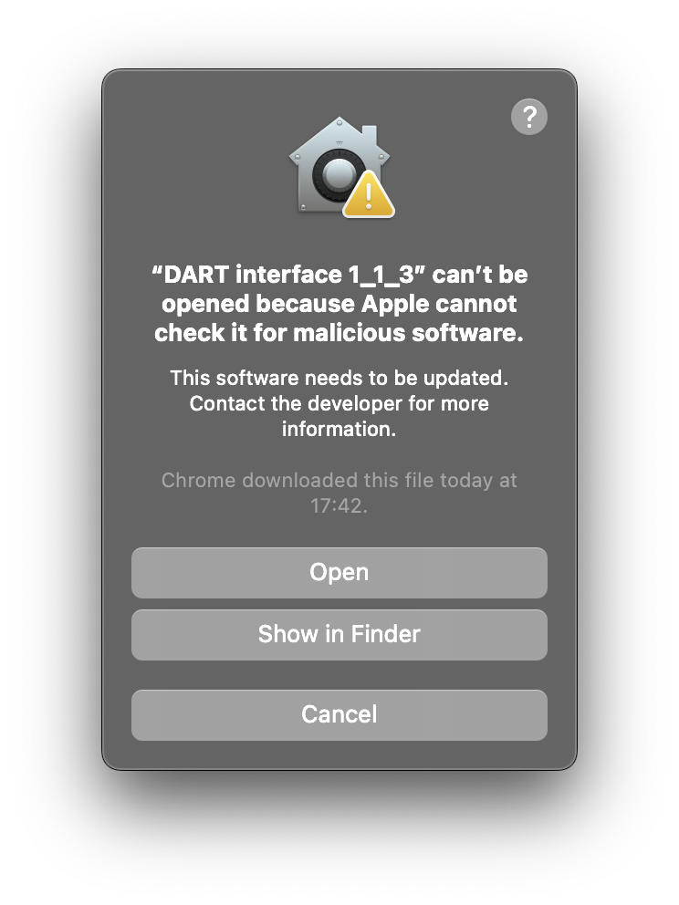
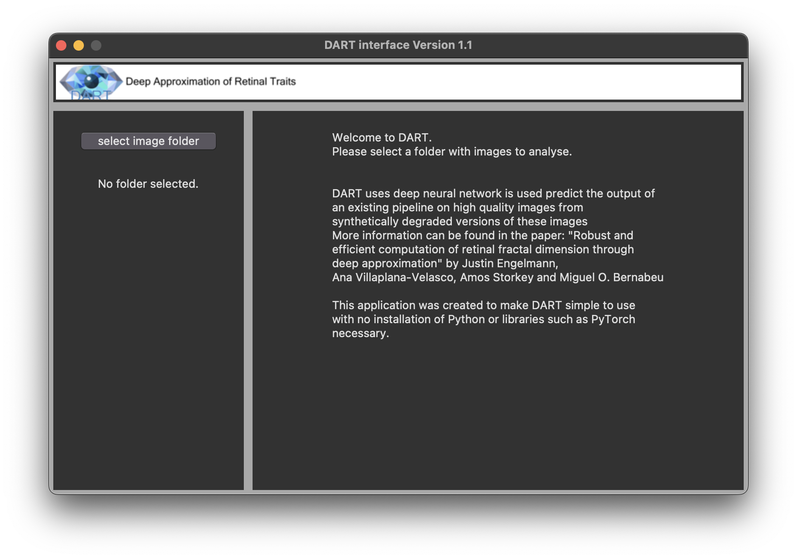
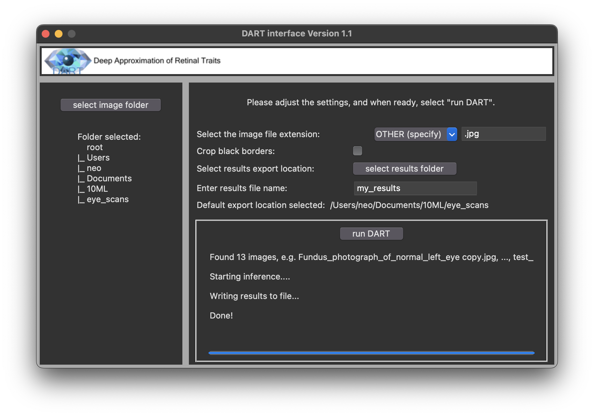
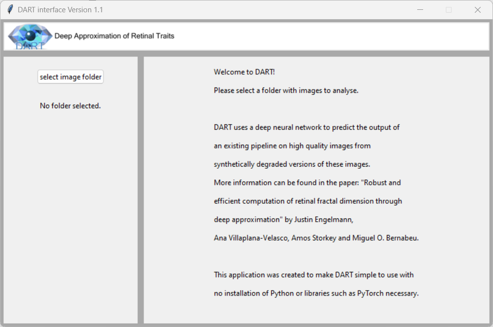
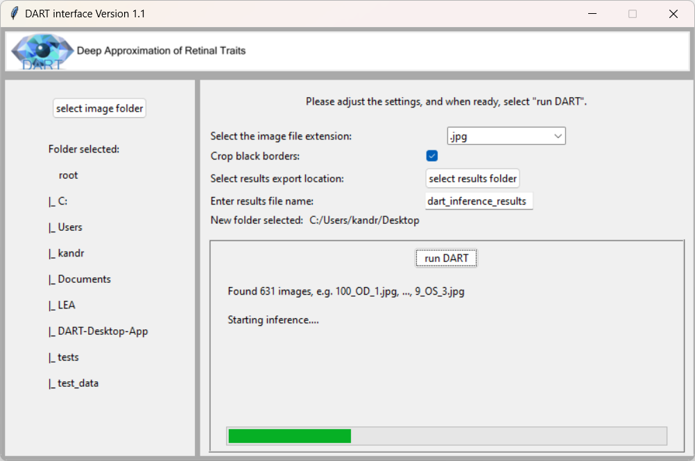

# DART Desktop App  
  
  
  
Graphical User Interface for the Deep Approximation for Retinal Traits (DART) codebase. 

From the [DART repository](https://github.com/justinengelmann/DART_retinal_fractal_dimension): "DART (Deep Approximation of Retinal Traits) allows to compute retinal traits very quickly (200-1,000 img/s on a single machine) and in a way that is more robust to image quality issues." The user interface was developed to allow for easy setup and usage of DART by bypassing the need for installing python, pytorch and various dependencies as well as basic knowledge of using the command line to enter parameters.

## Quick start

1. Head to this project's [Releases](https://github.com/eazXneo/DART-Desktop-App/releases).
2. Select the latest release and download either the Windows or MacOS .zip file.

On **MacOS**:

3. After downloading the zip and opening the file you will see a folder with a folder and an application both named "DART interface 1_1_3".
4. On first time opening the application you might have to right-click and then select "open"

5. After this, you should be able to open and run the application normally!

On **Windows**:

3. After downloading and opening the zip file you will see a folder called "main"
4. After opening this folder, you will see an application, also called "main"
5. This is the DART application. Opening this file for the first time you will have to extract all remaining files first.

6. Now you can open and use the application!

Please note that on a Windows machine, the "main" application must remain in its original folder to run correctly.

## Implementation details 
The interface itself was developed using tkinter following Object-Oriented Programming practices. tkinter was chosen due to its relative simplicity and being easy to learn. It suited the needs of this project to create a straightforward interface with native UI elements.

Testing was conducted to compare output from running the model directly vs using the interface. Passing tests indicate the result values generated when using the interface are acceptably close or identical compared with the values obtained from running the model by itself. Retinal scans from the [GRAPE dataset](https://springernature.figshare.com/articles/dataset/GRAPE_dataset_CFPs/23575926?backTo=%2Fcollections%2FGRAPE_A_multi-modal_glaucoma_dataset_of_follow-up_visual_field_and_fundus_images_for_glaucoma_management%2F6406319&file=41358156) were used as test data.

Some screenshots of the interface screens can be seen below:

## Ackowledgements
Special thanks to [@justinengelmann](https://github.com/justinengelmann) for advice and feedback on this project.

